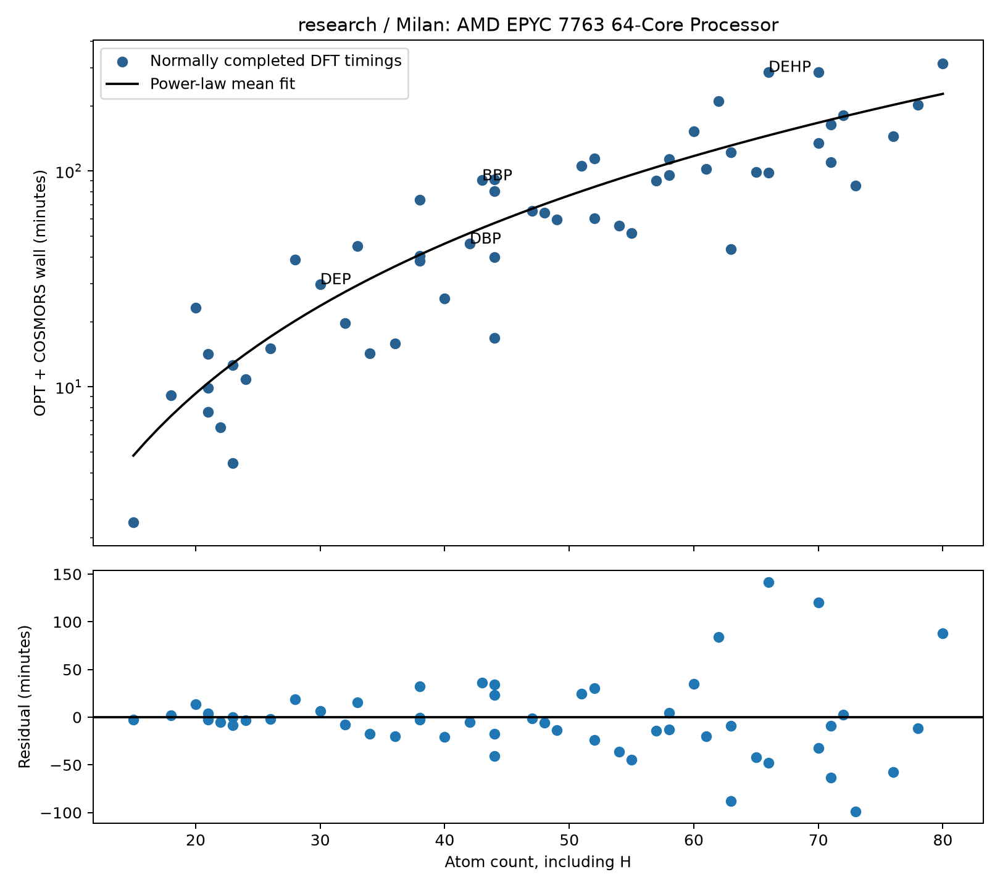

# Phase 1 pilot — final report and stop

Array **54154**, deterministic name `contam-p1-milan-v1`. Partition **research**, constraint **milan&cpu**, euler09/euler10 excluded. One array, concurrency cap **16**, one CPU, 4G RAM, 12-hour limit per task. Measured compute CPU model(s): **AMD EPYC 7763 64-Core Processor**. No Phase 2 submission.

Pilot disposition: **46/56 converged and identity-verified, 10/56 failed, 0/56 not yet run**; 0/56 running. A preflight input-representation failure is counted as failed, even though DFT did not execute for it. See the complete 56-row `molecules.csv` for every identity, timing, node, CPU model, memory measurement, returned-file size, and residual.

DFT execution coverage: **55/56 executed, 1/56 never executed**. Normally completed OPT + COSMORS: **55/56**; chemical acceptance is reported separately above.

## Selection and execution

56 unique CHNO InChIKeys were chosen deliberately: seven molecules per atom-count band (15–22, 23–30, 31–38, 39–46, 47–54, 55–62, 63–70, 71–80), with farthest-point coverage in atom count, heavy atoms, rotatable bonds, rings, aromatic atoms, nitrogen and oxygen. DEP, DBP, BBP, DEHP and dibenzyl phthalate were forced into the selection, along with the 15/80 endpoints. There were no MMFF availability, radical, or SMILES-key eligibility exclusions within this range. Preparation used the reference ETKDGv3/MMFF ranking settings: 300 candidate embeddings, seed 12345, 0.5 Å RMSD pruning, 2,000 MMFF iterations. Exactly one lowest-energy converged conformer per molecule was staged for DFT.

The frozen ORCA recipe was unchanged: serial, no `%pal`, `%maxcore 1500`, neutral singlet; OPT BP86/def2-TZVP(-f)/TightSCF followed by COSMORS(Water), whose generated solute SP uses BP86/def2-TZVPD. ORCA version/GIT, exact input decks and digests, node, CPU model/flags and elapsed times were recorded per executed task. The 56 staged XYZ digests and manifest were verified before submission.

One entry, benz[a]anthracene-d12 (`DXBHBZVCASKNBY-AQZSQYOVSA-N`, task 42), was confirmed pending and cancelled before DFT because plain XYZ had erased its isotope labels. It was not replaced or retried. An isotope-safe representation must be resolved before a later full campaign includes such inputs.

## Timings, scaling and residuals

For **AMD EPYC 7763 64-Core Processor / research / Milan**, the normally completed DFT timing fit is `mean wall seconds = exp(-0.687758) × atoms^2.305719 × 1.113048`. It models measured process wall time for OPT + COSMORS, including launch/I/O overhead; it is not a pure CPU-clock benchmark. Log-space RMSE: **0.472**. Observed/predicted wall ratios at the 10th/50th/90th percentiles: **0.47/0.92/1.66**. Each molecule’s signed seconds residual and ratio are in the CSV.

Applying the fitted completed-DFT cost model to all **5,833** pinned CHNO structures gives **4,831 serial CPU-hours**. The within-stratum bootstrap sensitivity range (5th–95th percentiles; 2,000 resamples) is **4,345–5,298 CPU-hours**, median **4,803**. At an illustrative 16-way concurrency with uninterrupted utilisation, this range corresponds to **11.3–13.8 days**, before queue delays or retry work. This is a scenario calculation, not approval of full-campaign concurrency.

The resampling range is conditional model uncertainty, not a coverage-guaranteed confidence interval: this was a deliberate diversity sample, not a random sample. Failures, chemistry-dependent stalls, and later queue load add uncertainty not captured by a smooth atom-count curve. No time-truncated run is silently treated as a cheap success. Failure/time-limit observations and elapsed lower bounds are retained below and in the CSV.

The population includes **244 structures below 15 atoms and 89 above 80 atoms**; costs for those are extrapolations. A full-campaign decision should review those tails and all failure modes instead of treating the fitted mean as a guarantee.

The measured returned-byte scaling projects **2.47 GB**, with a conditional bootstrap range **2.42–2.52 GB**, for the five-file bundles of 5,833 successful results. This replaces the earlier anchor-only sizing hypothesis; full scratch remains on Euler and is outside this return estimate.

The timing fit includes normally completed DFT runs whose chemical identity remains unresolved, because their measured atom counts and consumed computation time are still valid workload observations. This does not promote their surfaces to accepted chemical results. SCF/geometry failures and timeouts are excluded from the completed-run fit and retained in the separate all-attempt budget below.

**Failure-inclusive one-attempt budget:** **4,832 CPU-hours** for 5,833 attempts, conditional bootstrap sensitivity range **4,340–5,295 CPU-hours**. This uses all 55 executed terminal attempts, including elapsed cost of failed/limited runs, so costly failures do not vanish from the resource budget. The observed pilot consumed 74.05 attempt-hours. It excludes retry work and does not promise 5,833 successful surfaces. Timed-out completion costs remain lower bounds.

## Four workstation anchors

The comparison below uses the `TOTAL RUN TIME` lines from both architectures for consistency, rather than mixing those with process-launch wall time. Correction C-1 confirms the historical workstation CPU as Intel Core i7-13700 (Raptor Lake), not Broadwell; the Euler login node alone is Broadwell. The table reports cross-machine ratios for AMD EPYC 7763 (Milan) versus Intel Core i7-13700. Historical anchor times are not used to fit the campaign estimate. Initial conformers were regenerated; DEHP’s pinned input also leaves stereo unspecified, while the reference implementation names a specified stereoisomer. Thus these are workload timing comparisons, not controlled CPU-only benchmarks.

| Anchor | i7-13700 ORCA total (s) | EPYC 7763 ORCA total (s) | EPYC 7763/i7-13700 | Status |
| --- | ---: | ---: | ---: | --- |
| DEP | 481.061 | 1793.875 | 3.729 | converged |
| DBP | 1415.835 | 2765.930 | 1.954 | converged |
| BBP | 2798.357 | 5433.695 | 1.942 | converged |
| DEHP | 4133.584 | 17282.046 | 4.181 | failed |

The historical Intel Core i7-13700 optimisation cycle counts were DEP 8, DBP 17, BBP 32 and DEHP 25. BBP therefore needed nearly twice the geometry steps of DBP; the runtime difference was not just a smooth atom-count effect. Pilot geometry-cycle counts are included in the CSV alongside wall times.

The additional aromatic ester, dibenzyl phthalate, is identified in the CSV by `additional_aromatic_ester_dibenzyl_phthalate`.

On AMD EPYC 7763 64-Core Processor, dibenzyl phthalate (44 atoms) took **80.85 minutes**, a **+23.43-minute residual** and **1.41×** the size-fit mean. This is a second aromatic ester with appreciable excess cost.

## RAM, failures, identity and return records

Largest recorded Slurm batch-step MaxRSS: **1953.2 MiB**, with measurements available for **55/55 executed tasks**. All requests were 4G. Per-molecule high-water values are in the CSV; missing scheduler measurements remain blank.

Measured five-file bundle sizes span **189,128–854,167 bytes** across 55 normally completed DFT runs; total **28,978,962 bytes**. The CSV gives each exact size, including the separate preflight diagnostic record.

Executed runs without normal OPT + COSMORS completion: **0/55**. Failure modes across the 56 selected records: `identity_unresolved_stereochemistry`: 9/56; `isotope_labels_not_represented_in_xyz`: 1/56.

Identity policy used: `exact_full_inchikey`. Both RDKit and Open Babel geometry-perception observations are retained where obtained; no unresolved identity is relabelled as verified. Surfaces and exact input decks were digest-checked on return.

- `BJQHLKABXJIVAM-UHFFFAOYSA-N` — Bis(2-ethylhexyl) phthalate; **identity_unresolved_stereochemistry**; Geometry identity not accepted under current policy; see identity_observations.
- `TUXBECXCUZWDPY-UHFFFAOYSA-N` — Oxirane, 2,2',2''-[ethylidynetris(4,1-phenyleneoxymethylene)]tris-; **identity_unresolved_stereochemistry**; Geometry identity not accepted under current policy; see identity_observations.
- `MEXURWLRXYTWGT-UHFFFAOYSA-N` — 1-(4-Ethylcyclohexyl)-4-[4-(4-methylcyclohexyl)phenyl]benzene; **identity_unresolved_stereochemistry**; Geometry identity not accepted under current policy; see identity_observations.
- `BYLSIPUARIZAHZ-UHFFFAOYSA-N` — 2,4,6-Tris(1-phenylethyl)phenol; **identity_unresolved_stereochemistry**; Geometry identity not accepted under current policy; see identity_observations.
- `SJPFBRJHYRBAGV-UHFFFAOYSA-N` — N,N,N',N'-Tetrakis(2,3-epoxypropyl)-m-xylene-alpha,alpha'-diamine; **identity_unresolved_stereochemistry**; Geometry identity not accepted under current policy; see identity_observations.
- `GKFPPCXIBHQRQT-UHFFFAOYSA-N` — 6-(2-Carboxy-4,5-dihydroxy-6-methoxyoxan-3-yl)oxy-4,5-dihydroxy-3-methoxyoxane-2-carboxylic acid; **identity_unresolved_stereochemistry**; Geometry identity not accepted under current policy; see identity_observations.
- `QQKFUTGTZXPBGA-UHFFFAOYSA-N` — Benzoic acid, 4-[2-[4-(5-methyl-2-benzoxazolyl)phenyl]ethenyl]-, methyl ester; **identity_unresolved_stereochemistry**; Geometry identity not accepted under current policy; see identity_observations.
- `OOHPORRAEMMMCX-UHFFFAOYSA-N` — Dodecahedrane; **identity_unresolved_stereochemistry**; Geometry identity not accepted under current policy; see identity_observations.
- `DXBHBZVCASKNBY-AQZSQYOVSA-N` — Benz[a]anthracene-d12; **isotope_labels_not_represented_in_xyz**; see preflight exception record.
- `BQQUFAMSJAKLNB-UHFFFAOYSA-N` — Dicyclopentadiene diepoxide; **identity_unresolved_stereochemistry**; Geometry identity not accepted under current policy; see identity_observations.

Per InChIKey, returned artifacts are `surface.orcacosmo`, `result.json`, `opt.inp`, `cosmo.inp`, and `optimized.xyz` under `/mnt/r/plastchem-euler/results/<InChIKey>/`. Failed tasks return the available diagnostic record/decks without a fabricated surface. Exact returned bytes per molecule are in the CSV. Transfer uses the required multiplexed scp connection; local root space is checked before retrieval. Full scratch/stdout remain under `~/plastchem-euler/pilot-v1/runs/<InChIKey>/` on Euler.

Full-corpus representation audit: **9/5,833** pinned structures contain isotope labels that plain XYZ cannot preserve. One additional entry, carbon monoxide (`UGFAIRIUMAVXCW-UHFFFAOYSA-N`, 2 atoms), lacks MMFF parameters. Neither issue is silently removed from the 5,833 target or replaced with another molecule; both need explicit preparation/identity handling before full-campaign execution. The pilot contains only the one already reported isotope case and no CO. There are no radical structures or SMILES/InChIKey mismatches in the census audit. See `state/pilot-v1/representation-audit.json`.

## Reconciliation and phase gate

Before submission, both squeue and sacct were checked for the deterministic pilot name and were empty. One array receipt was recorded. Final reconciliation by deterministic name, covering the submission date across midnight, is preserved in `logs/pilot-final-name-reconciliation.txt`; the final squeue is empty. The A-1 reconciliation found exactly completed jobs 54150 and 54151; no duplicate diagnostic was submitted. The read-only monitor used a 120-second cadence with failure backoff and the prescribed ControlMaster/ControlPath/ControlPersist settings and exited after all tasks had terminal dispositions. The only later scheduler mutation was cancellation of the documented pending isotope task. No other campaign job was touched.

**Reported and stopped. Phase 2 remains unauthorised.** Retain research/Milan and per-result CPU-model records for any cleared continuation; a change of partition or CPU generation requires matching pilot calibration. Resolve identity/isotope cases before treating the pilot as unqualified full-campaign readiness. Historical anchor provenance was corrected by C-1.
